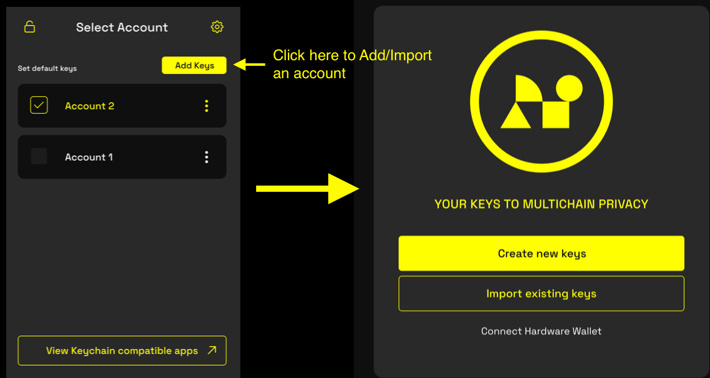
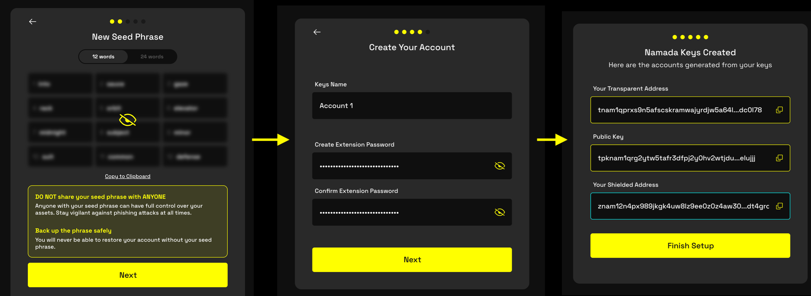
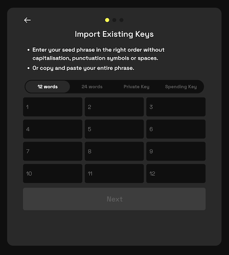

import { Callout, Steps } from 'nextra-theme-docs'

# Creating and Importing Accounts

To use Namada Keychain, you'll need to create (or import) an account (*a.k.a* your 'Keys' or your 'Wallet'). Creating an account 
will generate a transparent and shielded address and a set of secret keys—allowing you to send and receive tokens, as well as 
sign transactions to stake, vote on governance, and more.  

You can have several accounts in your keychain at the same time and switch between them as needed.

## Creating a New Account

<Callout type="info">
If you want to create an account using a Ledger hardware wallet, see the [dedicated section](./ledger) for Ledger-specific instructions.
</Callout>

1. Open Namada Keychain by clicking the extension icon in your browser toolbar. If you've previously completed the setup process, 
you'll see your current list of accounts. From here, click the "Add Keys" button in the top right corner to open a full-page modal 
with options to create a new account or import an existing one. (If this is your first time opening the extension, you'll be taken 
to the full-page view immediately.)  

2. Click the "Create New Keys" button to create a new account. Carefully review the warning message about the 
importance of keeping your seed phrase safe, then proceed to the next page.

3. Reveal your seed phrase by mousing over it. You can choose to generate either a 12 or 24 word seed phrase by clicking the 
toggle button above the seed phrase. Use '12 words' if you're unsure which to choose. Write down or otherwise securely save your seed phrase and proceed to the next 
screen, where you'll be asked to confirm two random words in order to verify that you've saved your seed phrase correctly.

4. On the next screen, you'll be asked to name your new account under 'Keys Name.' This is a label for your account, and can be changed later. **If this is your first time 
creating an account**, you'll also be asked to set a password for the extension (otherwise, you will only see an input field for 'Keys Name').   

If you've previously set a password for the extension, you won't be asked to set a new one. If you wish to change your password, you can do so at a later time in the [settings](./configure) 
menu.  
<Callout type="warning">
You'll be periodically asked to confirm this password when you open the extension, connect 
to an app, or sign transactions -- so make sure you back it up along with your seed phrase! Losing either your seed phrase or password can result in you losing access to your 
funds.
</Callout>

5. Finally, you'll be shown your new account's transparent and shielded addresses, as well as your public key. (It's not necessary to save these as you can view them at any time.) 
Click "Finish Setup" to complete the process.

## Importing an Existing Account

Importing an existing account is very similar to creating a new account, except after clicking the "Add Keys" button you should select "Import Existing Keys" 
instead of "Create New Keys."  

You'll be asked to provide the seed for your existing account in one of the following formats:
- A 12 word seed phrase
- A 24 word seed phrase
- A raw hex private key
- A raw hex spending key

Finally, you'll be asked to name your account, and (**if this is your first time initializing an account only**) set a password for the extension.

## Switching Between Accounts

You can have multiple accounts in your keychain at the same time, but only one account will be active at a time. To switch between accounts, 
click the Namada Keychain extension icon in your browser toolbar and click the checkbox to the left of the account you wish to use.  

Alternatively, you can click the 'three vertical dots' icon `⋮` next to the desired account and select "Set default account."

# Video Tutorial
For video tutorials on creating and importing accounts, see the following sections of [namada.help](https://www.namada.help/):
- [How to Create a Wallet](https://www.namada.help/tutorials/how-to-create-a-wallet)
- [How to Import a Wallet](https://www.namada.help/tutorials/how-to-import-a-wallet)
