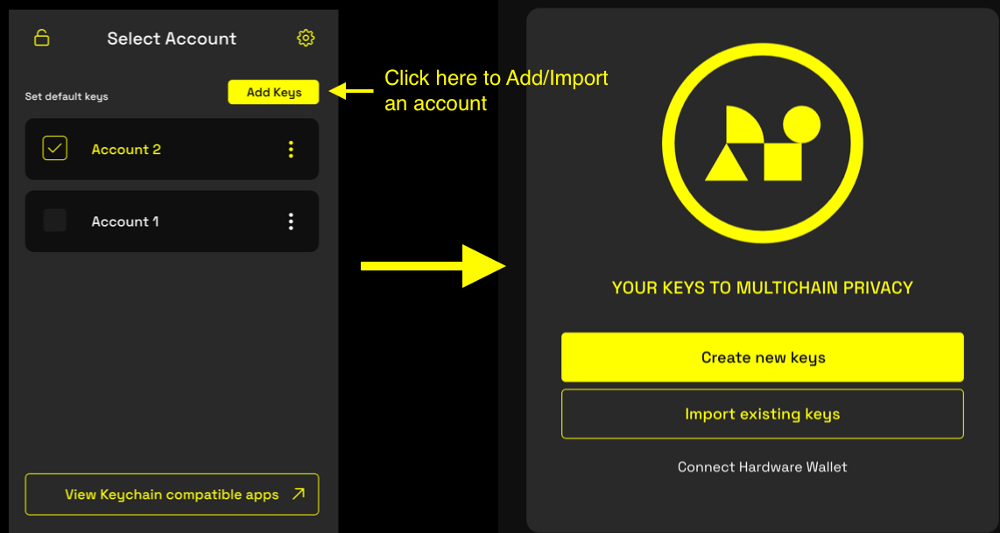

import { Callout, Steps } from 'nextra-theme-docs'

# Using a Ledger Hardware Wallet

You can use a [Ledger](https://www.ledger.com/) hardware wallet with the Namada Keychain extension. A hardware wallet is a physical device that generates and manages your 
private keys within the device itself, keeping them isolated from your computer and the internet. You connect your Ledger to your computer via USB and sign transactions by confirming 
via physical buttons on the device, adding an extra layer of security.

<Callout type="info">
Due to Ledger hardware limitations, you can only use shielded (MASP) operations with a Ledger Nano S Plus or newer. 
You can still use older devices for transparent operations such as staking and claiming rewards.
</Callout>

## Initial Setup

<Steps>
### Install Ledger Live
Install the [Ledger Live](https://www.ledger.com/ledger-live) app and complete the initial setup process for your Ledger, if you haven't already. See [Getting Started](https://support.ledger.com/article/4404389503889-zd) 
on the Ledger support site for more information.

### Install the Namada Ledger App
- Open Ledger Live and connect your Ledger device.
- Make sure your Ledger device is on the latest firmware. You can update your firmware in Ledger Live, in the "My Ledger" section.
- Access "My Ledger": Click on the My Ledger icon located in the bottom-left corner of the Ledger Live window.
- Connect Your Ledger Device: Plug in your Ledger device and unlock it by entering your PIN.
- Install the Namada App: In the App Catalog, use the search bar to find "Namada." Click the "Install" button to install the Namada application on your Ledger.

### Create a New Account with your Ledger
**Note:** See also the section on [Creating a New Account](./add-keys#creating-a-new-account). There are some minor differences 
in the process when using a Ledger device which are detailed below.

- Open Namada Keychain by clicking the extension icon in your browser toolbar. If you've previously completed the setup process, 
you'll see your current list of accounts. From here, click the "Add Keys" button in the top right corner to open a full-page modal 
with options to create a new account or import an existing one. (If this is your first time opening the extension, you'll be taken 
to the full-page view immediately.)   

  

- Select the "Connect Hardware Wallet" option.
- Follow Step 1: Connect your Ledger device to your computer via USB and unlock it by entering your PIN. Click "Next" when ready. You may be prompted by your browser to allow 
a USB connection to your Ledger device.  

- Follow Step 2: Open the Namada app on your Ledger device and click "Next" when ready.
<Callout type="info">
You can choose a custom derivation path by clicking the "Advanced" button located near the top of the view. You can use this option to derive multiple accounts from 
the same Ledger. If you're unsure what derivation paths are or how they work, ignore this setting and use the default. To 
learn more about derivation paths, see https://www.ledger.com/blog/understanding-crypto-addresses-and-derivation-paths.
</Callout>
- Your account will be derived from the seed stored in your Ledger device. You will be prompted to confirm each step on the Ledger 
device itself (you may need to do this several times).    

- After confirming on the Ledger, provide a name for your account when prompted on-screen and click "Next."
- Click "Create" to complete the process.
- Your transparent address and public key will be displayed on-screen. If you're using a Ledger Nano S Plus or newer, 
you'll also see a shielded address. You don't need to save these addresses as you can view them at any time in the extension.
- Click "Finish Setup" to complete the process.
</Steps>

### Differences from 'Standard' Accounts

Since Ledger-based accounts are derived from a seed stored in the device, the "View Seed Phrase" option will be greyed out. And 
since your private keys are managed by the Ledger and not stored in the extension, the "Display Spending Key" option is not available. 

## Video Tutorial
For a detailed video walkthrough on how to install the Namada Ledger app and create a new account using a Ledger, see the following section on [namada.help](https://www.namada.help/):
- [How to connect a Ledger device](https://www.namada.help/tutorials/how-to-connect-a-ledger-device)