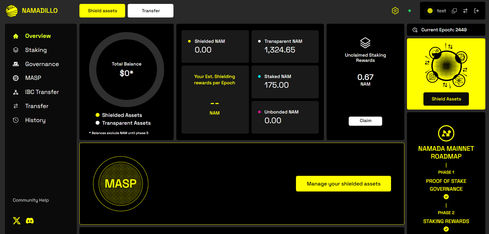

import { Callout } from 'nextra-theme-docs'

# Namadillo

<Callout type='info'>
Namada mainnet will launch with most functionality aside from staking and governance disabled, gradually enabling features in stages (via governance proposals) over the first 
few weeks. Therefore, some sections of Namadillo will not be accessible immediately after launch until its respective functionality has been activated on mainnet.  

Until then, you can experiment with all aspects of Namadillo on [testnet](../networks/testnets.mdx).
</Callout>

Namadillo is a web-based front-end for Namada developed by Heliax. Using Namadillo, along with the [Namada Keychain browser extension](./wallet/web-wallet.mdx), 
you can stake, vote in governance, shield and unshield assets, and send transparent, shielded, and IBC token transfers.  

<Callout emoji='😎'>
You can find links to many different Namadillo instances hosted by community members in the following places:
- On [namada.net](https://namada.net/apps#interfaces)
- On [namada.community](https://namada.community/infra/interfaces), the primary knowledge base for all community infra and services
- In the [namada-ecosystem github repo](https://github.com/Luminara-Hub/namada-ecosystem/tree/main/user-and-dev-tools) in an `interfaces.json`
</Callout>

This section of the docs provides step-by-step instructions for using the various features of Namadillo.  

