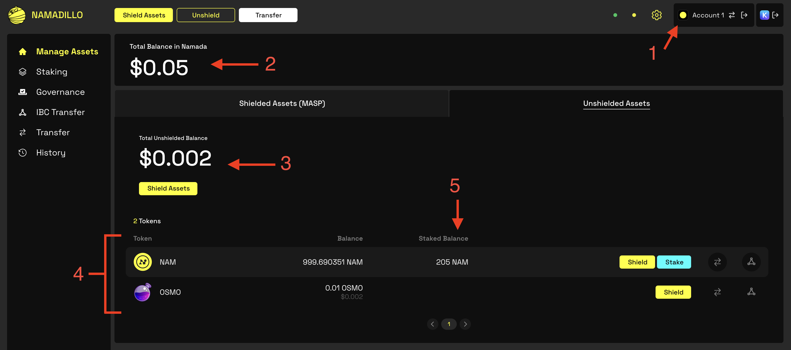

import { Callout } from 'nextra-theme-docs'

# Managing Your Assets

The **Manage Assets** panel of Namadillo gives a complete view of the shielded and transparent assets in your currently selected account.  

## Transparent Assets View
  

- **1** - The currently selected account.
- **2** - The combined value of all your transparent and shielded assets, in USD.
- **3** - The value of your transparent assets, in USD.
- **4** - All of your transparent assets, and their balances (in both tokens and USD value).
- **5** - Your currently staked balance (for NAM only).

## Shielded Assets View
  

- **1** - The currently selected account.
- **2** - The value of your shielded assets, in USD.
- **3** - All of your shielded assets, and their balances (in both tokens and USD value).
- **4** - The estimated Shielded Rewards you will earn from your shielded assets in the next 24 hours.
