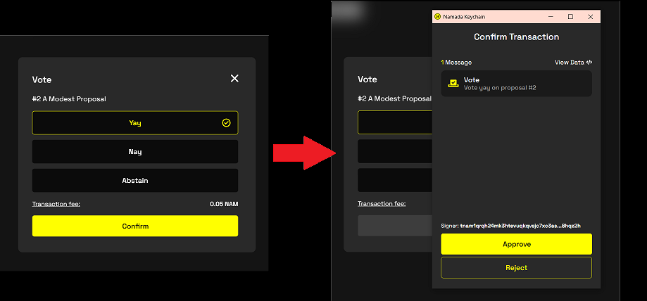

import { Callout, Steps } from 'nextra-theme-docs'

# Governance

You can view and vote on governance proposals from Namadillo.
Detailed information on how the governance system works at the protocol-level can be found [here](../governance.mdx). 

## Governance Info
By selecting 'Governance' from the left sidebar of Namadillo **(see below)**, you can get an overview of current, upcoming, and past 
governance proposals. By clicking on a listed proposal, you can bring up further details about that proposal.  

## Voting on Governance Proposals
<Callout type="info">
Remember that your voting power is equal to your staked tokens (not your total balance!) If you haven't staked any tokens with a validator, you won't 
be able to vote on governance. See the section on [Staking](./staking.mdx) for instructions on how to stake tokens.
</Callout>

To vote on governance proposals using Namadillo:  

<Steps>
### Select proposal
From the main Governance page, click on the "Ongoing" proposal you wish to vote on to bring up the proposal details (below).  

*Proposal detail view*  

In this view, you can see:
1. The proposal title and ID.
2. The type of proposal, and -- if any -- the attached WASM code. (The pictured proposal is 'Default' type and has no WASM code, meaning it is text-only).
3. The time remaining in the voting period.
4. The proposal abstract and description (Click 'Show More' to see the full description).
5. Proposal details such as the proposing address and the voting start, end, and activation epochs.
6. The current vote tally and turnout.

### Submit your vote
Click the 'Vote' button **(7, in the above image)**. A pop-up dialog will ask you how you wish to vote -- 'yay', 'nay', or 'abstain' -- select your vote 
and click 'Confirm'. The Keychain browser extension will show you another popup prompting you to confirm the signing of your transaction by entering your 
account password. After entering your password, your vote transaction will be submitted to the chain. Namadillo will display a small 
info box in the top right corner of the page to show that your transaction is being processed and, after roughly 10 seconds, whether it was accepted.

*Voting transaction dialogs*  

### View and/or change your vote
If your vote has been registered on-chain, Namadillo will update its display with your vote **(1, below)**. If the voting period is still 
ongoing, you can change your vote by clicking the 'Edit Vote' button **(2, below)** and repeating the voting process.

*You can change your vote as long as the proposal is still ongoing*  
</Steps>