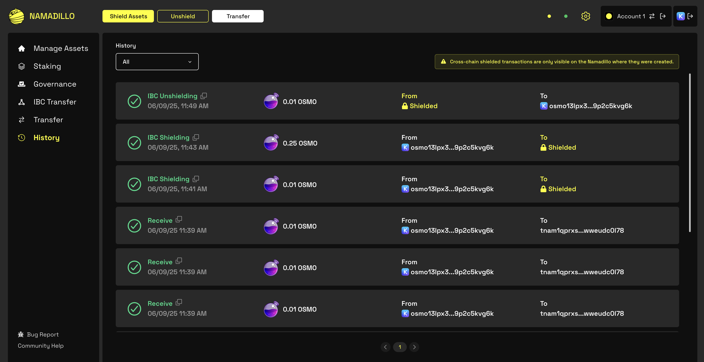

import { Callout } from 'nextra-theme-docs'

# Transaction History

To view your transaction history, select ** History** from the left sidebar. This will open the *Transaction History* view, as shown in the image below. You can filter your history by 
transaction type. 

<Callout type='info'>
Cross-chain shielded transactions are only visible on the Namadillo where they were created.
</Callout>

*The Transaction History view*
