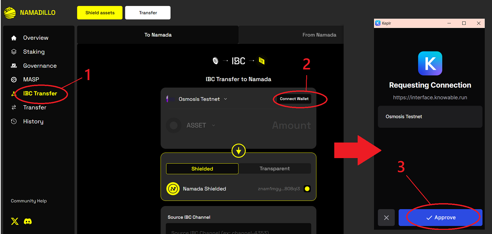
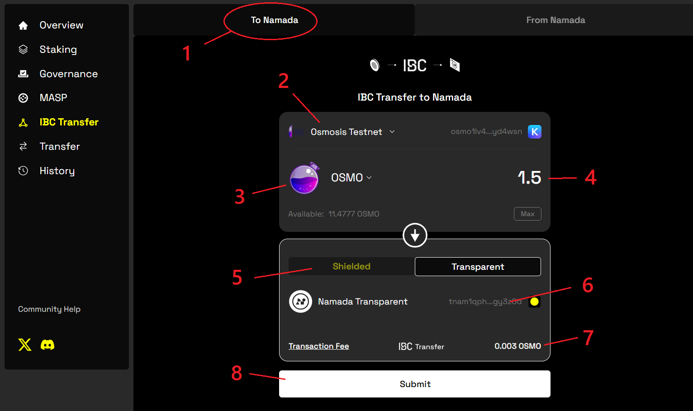
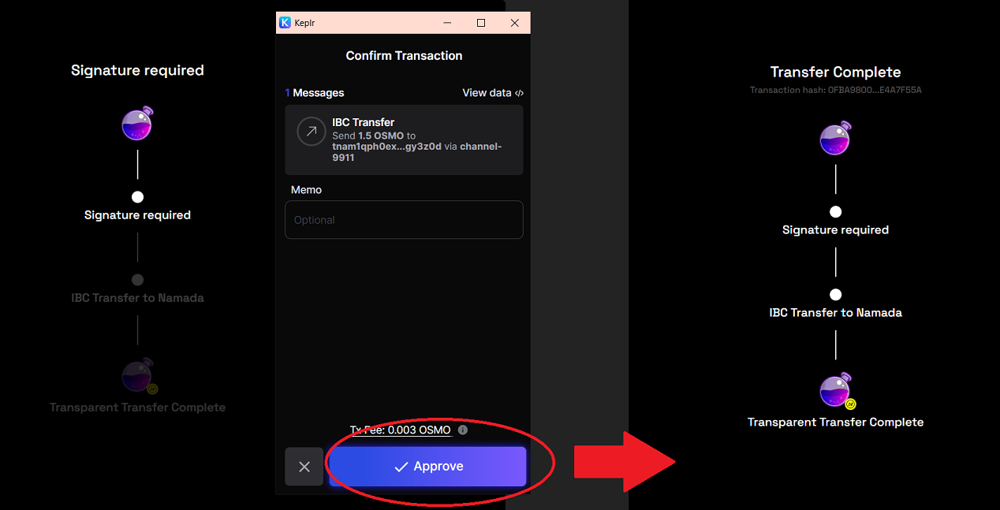
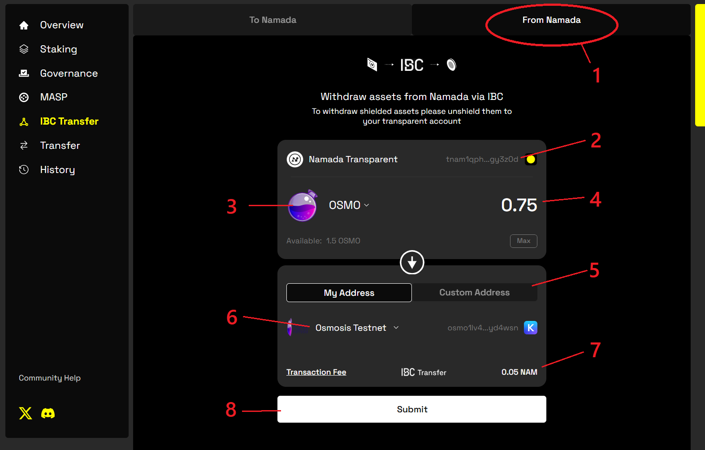
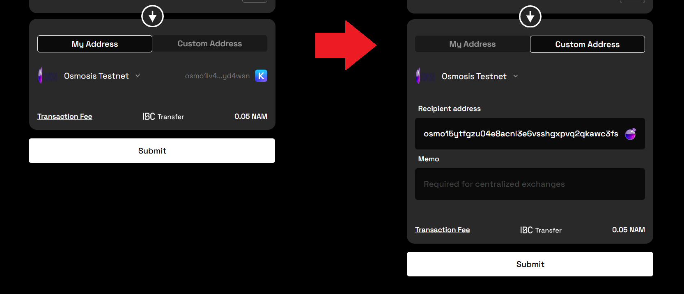

import { Callout, Steps } from 'nextra-theme-docs'

# IBC Transfers with Namadillo

Learn more about IBC on Namada beyond Namadillo [here](../ibc.mdx). 

<Callout type='info'>
Namada mainnet will launch with most functionality aside from staking and governance disabled, gradually enabling features in stages (via governance proposals) over the first 
few weeks. Therefore, some sections of Namadillo will not be accessible immediately after launch until its respective functionality has been activated on mainnet.  

Until then, you can experiment with all aspects of Namadillo on [testnet](../networks/testnets.mdx).
</Callout>

You can connect Namadillo to your [Keplr wallet](https://www.keplr.app/) to transfer assets between Namada and IBC compatible chains, such as 
*Osmosis* and the *Cosmos Hub*. Namadillo supports both transparent and shielded IBC transfers.

- **Transparent IBC transfers:** Transfers between a transparent (`tnam...`) address and another chain. After receiving 
assets to your transparent address, they will be added to your transparent balance. You can (optionally) shield them at a later time. But as always, keep in 
mind that a third party can view all balances and transactions of any transparent address at any point in the chain's history. You can use your 
transparent address to both send and receive assets over IBC.
- **Shielded IBC transfers:** Transfers between a shielded (`znam...`) address and another chain. 
These transfers move immediately to/from your shielded balance without needing to pass through your transparent address first. This 
[reduces](../../introduction/privacy.mdx) the chances of leaking information about your on-chain activity.  

When using Namadillo, you can only use your shielded address to receive assets. (To send them over 
IBC, you must first unshield them.)

## Connecting To Keplr
To send IBC assets to Namada, you will need an account on the source chain (e.g. *Osmosis*, *Cosmos Hub*, etc.) containing the assets you wish to send.  

[Keplr wallet](https://www.keplr.app/) is the most widely used wallet app for Cosmos SDK chains. Namadillo has Keplr integration to allow IBC transfers 
to and from your existing Keplr accounts.  

This rest of this section assumes you have already created and funded an account on the source chain using Keplr. For help getting started with Keplr, 
please refer to https://help.keplr.app/start.  

Once you've installed Keplr and created or imported an account on the source chain, follow these steps to connect Keplr with Namadillo:

1. Click *IBC Transfer* in the left sidebar of Namadillo **(1)** to open the IBC panel.
2. Click *Connect Wallet* **(2)**.
3. Click *Approve* in Keplr when the *Requesting Connection* **(3)** popup appears

*Connecting your Keplr wallet to Namadillo*

## Sending IBC Transfers 'To Namada' (from another chain)
You can bring assets from another chain to your Namada shielded or transparent balance; think of this as 'depositing' assets from other chains into 
Namada.  

Begin by selecting '*To Namada*' **(1)** in the *IBC Transfer* section and follow these steps:  

*Making an IBC transfer into Namada (i.e. Depositing assets)*

<Steps>
### Enter the transfer details
- **(2)**: Click to select the *network you wish to bring assets from* (e.g. Osmosis, Cosmos Hub, etc.). Once you've selected a network, your address 
on the sending chain will be read from Keplr and displayed here.
- **(3)**: Click to select the asset you wish to transfer.
- **(4)**: Enter the amount to transfer.
- **(5)**: Click to specify whether to send the asset to your shielded or transparent address.
- **(6)**: Your receiving address will be automatically filled from the Keychain extension. If you selected *Shielded* directly above, this will show 
your shielded address; if you selected *Transparent* it will show your transparent address. The address shown will match the currently selected account 
in the Keychain extension.
- **(7)**: The transaction fee for this transfer -- note that fees are paid in the asset being transferred.
- **(8)**: When you've chosen a source network, asset, amount, and whether to send to your shielded or transparent address, click *Submit* to begin the transfer.

### Click 'Submit' and approve your transaction
After entering the required transfer info, click *Submit*, at which point you'll be prompted to approve the transaction.  

Note that when IBC transferring assets to Namada, you'll be asked to confirm the transaction in Keplr (not Namada Keychain).  

*Confirming the transaction in Keplr*
</Steps>

## Sending IBC Transfers 'From Namada' (to another chain)
You can also transfer assets (including, but not limited to, NAM) to another chain. Remember that you can only make outgoing IBC transfers from your transparent 
address -- if you wish to transfer shielded assets, you must unshield them first.  

Begin by selecting '*From Namada*' **(1)** in the *IBC Transfer* section and follow these steps:  

*IBC Transferring assets out of Namada*

<Steps>
### Enter the transfer details
- **(2)**: Your transparent address (from which the transfer is being sent). This is automatically filled from the Keychain extension based on your 
currently selected account. Note that outgoing IBC transfers using Namadillo cannot be made from a shielded account.
- **(3)**: Click to select the asset you wish to transfer.
- **(4)**: Enter the amount to transfer.
- **(5)**: Select *My Address* to automatically set the receiver to your Keplr address on the destination chain. Select *Custom Address* to enter a different address. 
(See below for more details.)
- **(6)**: Click here to select the destination chain.
- **(7)**: The transaction fee for this transfer -- note that fees are paid in NAM.
- **(8)**: When you've chosen an asset, amount, destination chain, and receiving address, click *Submit* to begin the transfer.  

**Setting a custom receiver address:**  
By selecting *Custom Address*, you can send assets to an address not in your Keplr wallet. Choosing this option also (optionally) lets you attach 
a memo to the transaction. *Make sure the receiver is a valid address on the destination chain* -- e.g. if the destination chain is *Osmosis*, the 
address should have an *osmo* prefix.

### Click 'Submit' and approve your transaction
After entering the required transfer info, click *Submit*. You'll be prompted to approve the transaction and it will begin processing. When the transfer 
has completed, the status will update to show *Transfer Completed*.
</Steps> 