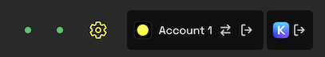

import { Callout, Steps } from 'nextra-theme-docs'

# IBC Transfers

If you're looking for information on IBC operations using the Namada CLI, please see [here](../ibc.mdx).  

You can connect Namadillo to your [Keplr wallet](https://www.keplr.app/) to transfer assets between Namada and IBC compatible chains, such as 
*Osmosis* and the *Cosmos Hub*. Namadillo supports transparent and shielded IBC deposits and withdrawals.  

## Connecting to Keplr

This section assumes you have already installed Keplr and created or imported an account. For help getting started with Keplr, please refer to https://help.keplr.app/start.  

To connect Keplr to Namadillo, click the **Connect Wallet** button while creating an IBC transfer and approve the connection request. When properly connected, your Keplr wallet address will be displayed 
and you'll see a Keplr icon at the top of Namadillo.

*Connecting Keplr to Namadillo*  

*Keplr connection visible in top bar*

## Deposit (IBC Transfers to Namada)

In order to deposit IBC assets into Namada, you must first install Keplr, create or import an account, and fund it on the source chain. Then, connect 
Keplr to Namadillo (see above). Keplr is needed to sign the IBC transaction on the source chain.  

To deposit IBC assets into Namada, do the following:
1. Select **IBC Transfer** in the left sidebar of Namadillo, and select the **Deposit** tab from the top of the view.
2. Connect your Keplr wallet by clicking the **Connect Wallet** button and approving the connection request. Once connected, your Keplr wallet address will be displayed 
and you'll see a Keplr icon at the top of Namadillo.
3. Select the source chain/asset and amount you wish to deposit.
4. Use the toggle button to select whether you wish to make a transparent or shielded deposit. Depending on your choice, the color scheme of the interface will change and 
the receiving address will automatically be filled with your transparent or shielded address, respectively.
5. Click **Submit** to begin. Approve the transaction via your Keplr wallet. After a few seconds, you should see a confirmation dialog with the details of your IBC transfer.  

After depositing assets, you'll be able to see them in the [Manage Assets](./assets.mdx) section of Namadillo. You'll also be able to see the transaction 
in the [History](./history.mdx) section.

<Callout type="info">
Making a shielded deposit from the **IBC Transfer** section is equivalent to selecting **Shield Assets** and then **IBC Shield** from the topbar. See 
the [Shielding Assets](./shield.mdx) section for more details, including important information on Shielded Rewards.
</Callout>

## Withdraw (IBC Transfers from Namada)

When withdrawing IBC assets from Namada, you may wish to install and connect Keplr as discussed above. This will allow you to automatically fill the 
receiver address with your Keplr address on the destination chain. However, you can also proceed without Keplr by manually entering the receiver address.

To withdraw IBC assets from Namada, do the following:
1. Select **IBC Transfer** in the left sidebar of Namadillo, and select the **Withdraw** tab from the top of the view.
2. Select the destination chain/asset and amount you wish to unshield.
3. Use the toggle button to select whether you wish to make a transparent or shielded withdrawal. Depending on your choice, the color scheme of the interface will change and 
the sender address will automatically be filled with your transparent or shielded address, respectively.
4. You can either connect your Keplr wallet or manually enter a destination address. To connect your Keplr wallet, click **Connect Wallet** and approve the connection request. 
Once connected, your Keplr address will be displayed and you'll see a Keplr icon at the top of Namadillo. To manually enter a destination address, click the 
**Custom Address** toggle and enter the address in the text field. Remember that the receiver address must be a valid address on the destination chain (e.g. an address beginning 
with *osmo...* if the destination chain is *Osmosis*).
5. Click **Submit** to begin. Approve the transaction via Namada Keychain. After a few seconds, you will see a confirmation dialog with the details of your IBC transfer.  

<Callout type="info">
Withdrawing a shielded asset from the **IBC Transfer** section is equivalent to selecting **Unshield** and then **IBC Unshield** from the topbar. See 
the [Unshielding Assets](./unshield.mdx) section for more details, including important information on failed transactions and refund addresses.
</Callout>
