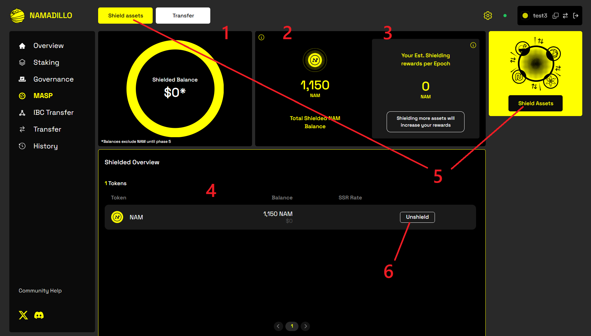
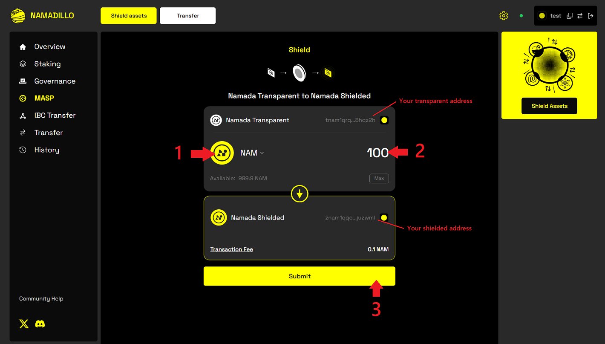
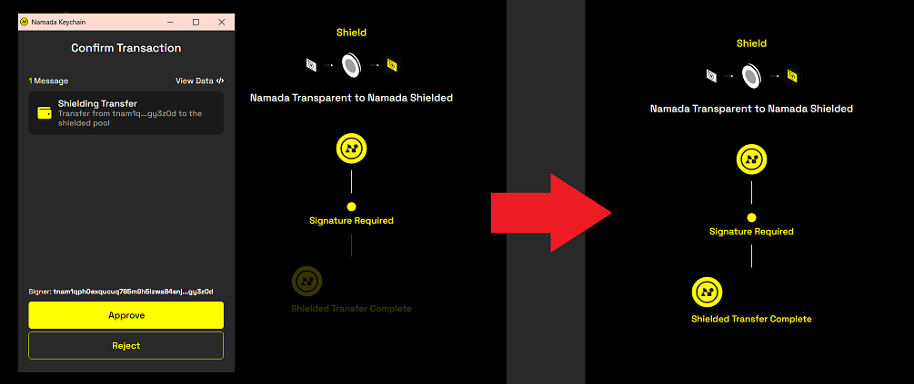
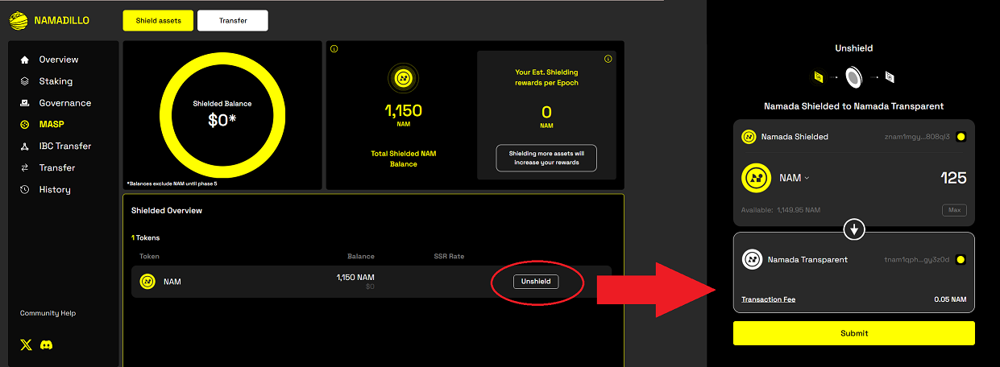

import { Callout, Steps } from 'nextra-theme-docs'

# Shielding Assets with Namadillo

<Callout type='info'>
Namada mainnet will launch with most functionality aside from staking and governance disabled, gradually enabling features in stages (via governance proposals) over the first 
few weeks. Therefore, some sections of Namadillo will not be accessible immediately after launch until its respective functionality has been activated on mainnet.  

Until then, you can experiment with all aspects of Namadillo on [testnet](../networks/testnets.mdx).
</Callout>

One of Namada's flagship features is the ability to move your assets into the **Multi-Asset Shielded Pool** (*a.k.a.* the 
*MASP* or *Shielded Pool*). Moving assets into the pool to your shielded balance is referred to as *shielding*, and moving assets out of the pool to your transparent balance 
is referred to as *unshielding*. By holding eligible assets in the MASP you'll earn rewards in the form of *NAM*, which will automatically 
be added to your shielded balance each epoch.  

You can use the *MASP* tab of Namadillo to manage your shielded assets and rewards, including: 
- viewing your current asset balances
- shielding and unshielding assets
- viewing your estimated shielded rewards per epoch  

You can also transfer shielded assets from your shielded account to another shielded recipient (*i.e.* a **Shielded Transfer**) in Namadillo's *Transfer* tab. 
For instructions on the steps to make a shielded transfer using Namadillo, refer to the [Transfer](./transfer.mdx) section of this guide.

## Shielded Assets (MASP) Dashboard
Select **MASP** from Namadillo's left sidebar to open the dashboard **(below)**. On the dashboard, you can see:
- **(1)** and **(2)**: Your total shielded balance and shielded NAM balances, respectively.
- **(3)**: Your estimated shielded rewards per epoch.
- **(4)**: A list of all your currently owned shielded assets.
- **(5)**: Click any of the buttons marked **Shield Assets** to shield an asset, moving it from your transparent balance to your shielded balance.
- **(6)**: Click the **Unshield** button beside any of your shielded assets to unshield some or all of that asset  

*Clicking 'MASP' in the left sidebar lets you manage your shielded assets*

## Shielding Assets
From the Shielded Assets (MASP) Dashboard, follow these steps to shield an asset:
<Steps>
### Click any of the buttons marked 'Shield Assets'
This will open the Shielding dialog as shown below.

### Choose an asset type and amount
Your transparent and shielded addresses will be automatically entered based on your active account in the Keychain browser extension. 
First, check that they match the expected values. If not, open the Keychain extension to switch to the correct account.  

- **(1)**: Click here to select an asset type.
- **(2)**: Enter the amount you wish to shield here.
- **(3)**: After choosing an asset and amount, click **Submit** to begin shielding.  

*Choosing the asset and amount to shield*

### Click 'Submit' and approve your transaction
After entering the required info, click **Submit**. You will be prompted by the extension to approve the transaction; if you're using 
a Ledger, you will be prompted to confirm on the device, otherwise you will be prompted to enter your password. **Note: it may take slightly longer 
to construct the shielding transaction and show the confirmation dialog compared with other transaction types.**  

After confirming, an animation will play to show that your shielding transaction is being processed. After roughly 10 seconds, the display will update 
with *Shielded Transfer Complete* as in the following image:  

*Shielding transaction confirmation*
</Steps>

## Unshielding Assets
The process for unshielding assets is very similar to shielding them. 

<Steps>
### Find your current shielded assets
Click **MASP** in Namadillo's sidebar to open the MASP dashboard, and find the list of your current shielded assets in the **Shielded Overview** section.

### Click 'Unshield'
Click the button marked **Unshield** beside the asset you wish to unshield. This will open the Unshield dialog, where your selected asset type, shielded address and transparent 
address will all be automatically entered. You will need to enter the amount you wish to unshield and click 'Submit' when you're ready.  

*Unshielding an asset*

### Click 'Submit' and approve your transaction
Follow the prompts to approve your transaction and wait for it to process, as explained in the previous section on 
[shielding](#click-submit-and-approve-your-transaction).
</Steps>

## Viewing your estimated Shielded Rewards
Shielded rewards accrue each epoch based on the amount of assets you have shielded, and are automatically added to your shielded *NAM* balance. You can 
view an estimate of your expected rewards per epoch both in the **MASP** and **Overview** (homepage) sections of Namadillo.  

<Callout type="warning">
**Note:** your actual shielded rewards will depend on the total asset amounts held in the MASP by all users. Therefore, the number shown is only an estimate.

</Callout>

Not all asset types will earn shielded rewards at the same rate; you can view the reward rate of each shielded asset in the **MASP dashboard** in the 
**Shielded Overview** section, which contains a list of your current shielded assets. Check the column named **SSR Rate** for the reward rate of eligible assets (if no rate is listed, 
that asset is not eligible for shielded rewards).