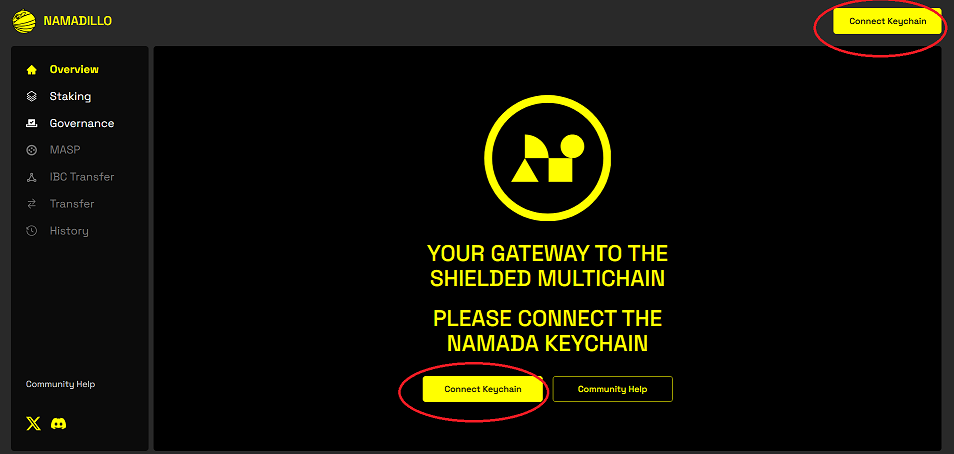
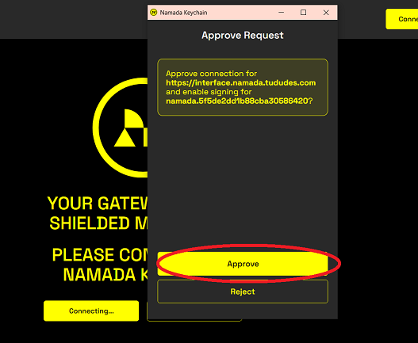

import { Callout, Steps } from 'nextra-theme-docs'

# Namadillo Overview

<Callout type='info'>
Namada mainnet will launch with most functionality aside from staking and governance disabled, gradually enabling features in stages (via governance proposals) over the first 
few weeks. Therefore, some sections of Namadillo will not be accessible immediately after launch until its respective functionality has been activated on mainnet.  

Until then, you can experiment with all aspects of Namadillo on [testnet](../networks/testnets.mdx).
</Callout>

Namadillo is a web-based front-end for Namada developed by Heliax. Using Namadillo, along with the [Namada Keychain browser extension](./wallet/web-wallet.mdx), 
you can stake, vote in governance, shield and unshield assets, and send transparent, shielded, and IBC token transfers.  

<Callout emoji='😎'>
You can find a links to a list of vetted Namadillo instances hosted by community members at https://namada.net/apps#interfaces.
</Callout>

## Getting started with Namadillo

Before using Namadillo, you will need to install the [Namada Keychain browser extension](../wallet/web-wallet.mdx) and 
follow the steps for initial setup, including setting a password and creating a new account. See the section in the docs [here](../wallet/web-wallet.mdx) for detailed 
instructions.

<Steps>
### Navigate to Namadillo
Navigate to one of the hosted Namadillo instances at https://namada.net/apps#interfaces.

### Connect the extension
In the top right corner of Namadillo, click the **Connect Keychain** button to begin using Namadillo. You will be asked by the extension 
to approve the connection, which will allow Namadillo to see **non-secret** information about your account (such as your public key and addresses).  

*Note:* If you do not see a button marked 'Connect Keychain', you haven't installed the [Namada Keychain browser extension](../../users/wallet/web-wallet.mdx) yet.  

*Click either button marked 'Connect Keychain'*  

*Approve the connection request*
<Callout type='info'>
You can disconnect from a site at any time in the extension by clicking on the extension icon in your browser bar to open it, and selecting 
**Settings** (the gear icon), then **Connected Sites**. (Make sure you're opening the settings in the extension itself, not the Namadillo webpage.)
</Callout>

</Steps>

### Setting the RPC/Indexer endpoints (Optional)
Namadillo relies on three endpoints to access up-to-date info on the state of the chain: an *RPC*, an *Indexer*, and a *MASP Indexer*. 
Typically, these services are operated by the same provider as Namadillo itself and correctly configured by default, so there is no need for you 
as a user to worry about these values.  

However, if you wish to change any of these endpoints, or simply view the currently configured values, you can do so in the Namadillo settings. Click 
the **Settings** (gear icon) in the top right of the webpage and choose **Advanced** to view or change them.

### Troubleshooting
If Namadillo is not displaying your balance correctly or connecting to the extension, try 
these steps in order:
1. *Perform a hard refresh of the Namadillo page:* press **Ctrl**+**Shift**+**Refresh** button (Windows) or **Cmd**+**Shift**+**Reload** button (Mac).
2. *Repeat the connection process:* Open the extension settings and disconnect from Namadillo as explained [here](#connect-the-extension). Then perform a hard refresh 
as explained in Step 1 and re-connect the extension.
3. *Manually set the Chain-Id*: open the extension by clicking its icon in the browser toolbar, and click the gear icon to open the 
**Settings** menu. Select **Network** and enter the correct Chain-Id and click **Submit**; then refresh. Afterwards, perform a hard refresh as 
explained in Step 1.

### A note on 'Reveal PK' transactions
Whenever you're submitting a transaction of any kind for the first time from an address, you'll also see a 'Reveal PK' (Reveal Public Key) 
transaction automatically bundled with your other transaction(s) **(6, below)**. These are part of the Namada protocol, but as a user you don't need 
to worry about it; Namadillo will automatically insert these when required.

*Example of a staking transaction with Reveal PK message*