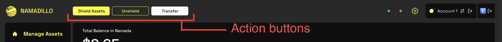
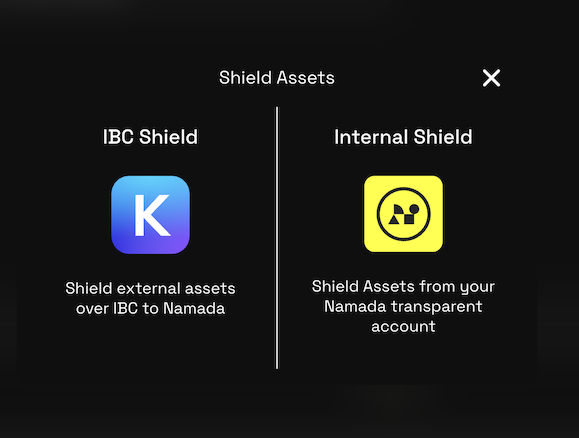
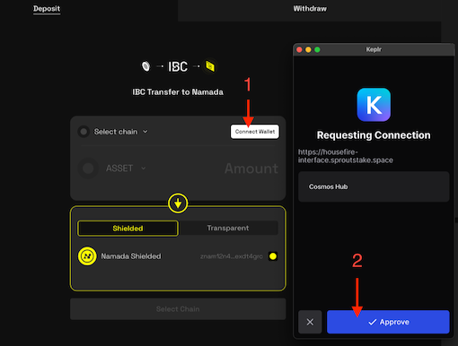
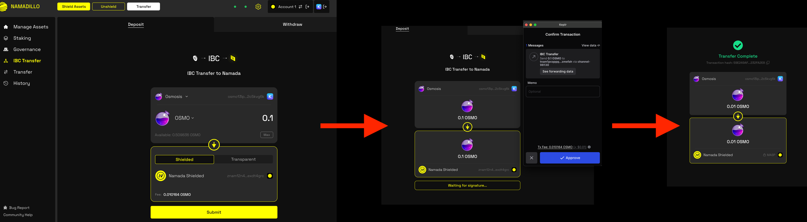
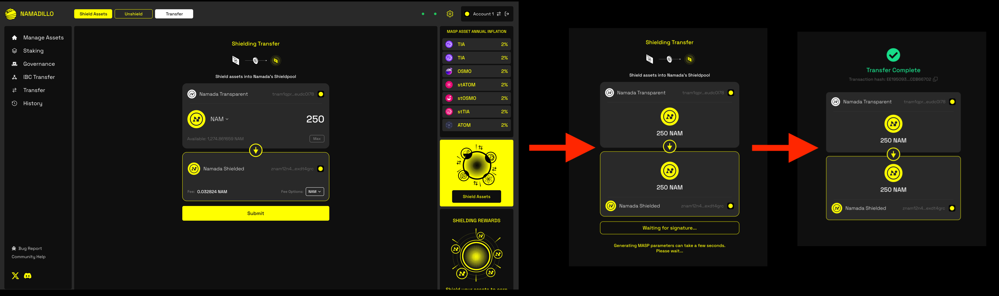

import { Callout, Steps } from 'nextra-theme-docs'

# Shielding Assets

<Callout type="info">
You can learn more about Namada's Shielded Pool (aka: the MASP) and its features [here](../shielded-accounts.mdx). 
</Callout>

You can shield assets (both NAM and IBC assets from other chains) in Namada's Shielded Pool using Namadillo. For certain IBC assets, you will also earn Shielded Rewards (see below for more details).   

To begin shielding, click the **Shield Assets** button in the Namadillo's topbar, and then choose between *IBC Shield* or *Internal Shield*.  

- **IBC Shield**: Deposit assets from another chain (using IBC) directly into your shielded balance.
- **Internal Shield**: Shield assets you already hold in your transparent Namada balance.

  

## IBC Shielding
Before you can begin IBC shielding, you'll need to have installed [Keplr wallet](https://www.keplr.app/) and funded an account on the source chain.  

For help getting started with Keplr, please refer to https://help.keplr.app/start.  

Once you're ready to begin IBC shielding, do the following:

1. Click the **Shield Assets** button in the Namadillo's topbar and select **IBC Shield**.
2. Connect your Keplr wallet by clicking the **Connect Wallet** button and approving the connection request. When properly connected, your Keplr wallet address will be displayed 
and you'll see a Keplr icon at the top of Namadillo.
3. Select the source chain/asset and amount you wish to shield.
4. The **Shielded** toggle should be already selected by default and your Namada shielded address will be displayed. If not, select the **Shielded** toggle now.
5. Click **Submit** to begin. Approve the transaction via your Keplr wallet. After a few seconds, you should see a confirmation dialog with the details of your shielding transaction.  

*Connecting Keplr to Namadillo*  

*IBC shielding*

## Internal Shielding
Before you can begin internal shielding, you'll need to already hold some assets in your transparent balance on Namada. You can shield both NAM and IBC assets.  

To begin internal shielding, do the following:

1. Click the **Shield Assets** button in the Namadillo's topbar and select **Internal Shield**.
2. Select the asset and amount you wish to shield.
3. Click **Submit** to begin. Approve the transaction via Namada Keychain. After a few seconds, you should see a confirmation dialog with the details of your shielding transaction.  

*Internal shielding*

## Viewing your Shielded Assets and Shielded Rewards
After you've shielded assets, you'll be able to view them in the [Manage Assets](./assets.mdx) section of Namadillo (which can be selected from the left sidebar).  

Certain assets are eligible for Shielded Rewards. By holding these assets in your shielded balance, you'll earn rewards in the form of NAM every 24 hours. The determination 
of which assets are eligible for Shielded Rewards and the reward rate for each asset is determined by on-chain governance.  

You can see which assets will earn Shielded Rewards in a few different ways:  
- In Namadillo: if an asset's estimated rewards are 0, it is not eligible for Shielded Rewards.
- Also in Namadillo: by visiting the **Internal Shield** page, the right sidebar will display a list of assets that are eligible for Shielded Rewards and their annual inflation rate.
- By visiting the [Namada Metrics Dashboard](https://metrics.namada.net) or the [Reward Simulator](https://rewardsim.luminara.icu).

In the [Manage Assets](./assets.mdx), you'll see a list of your shielded assets and an estimate of your expected Shielded Rewards for the next 24 hours.  

<Callout type="info">
- Your actual Shielded Rewards for an asset will depend on the total amount of that asset held in the Shielded Pool by all users.
- Assets may earn rewards at different rates. The rate for each asset is determined by on-chain governance.
- To incentivize deposits, the reward rate for each asset is highest when there is a low amount of that asset held in the Shielded Pool, tapering off as the amount approaches 
that asset's *Target Locked Amount*. Shielding assets with a low amount in the Shielded Pool is a good strategy to maximize your rewards.
- Due to the dynamic nature of the rewards calculation, the expected rewards displayed in Namadillo are estimates only.
</Callout>
