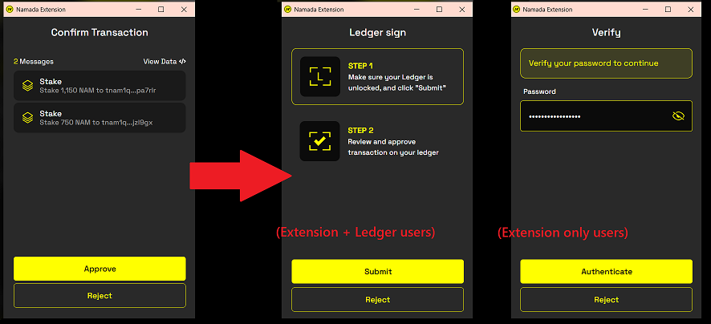

import { Callout, Steps } from 'nextra-theme-docs'

# Staking in Namadillo

In the **Staking** panel of Namadillo, you can stake, unstake, redelegate, and claim your staking rewards. You can also view your staking positions and see the status of 
your unbonding requests.  

You can safely stake NAM in a Ledger hardware wallet, since Namada Keychain features full Ledger support.  

<Steps>
### Open the staking dashboard
From the left panel, select 'Staking' **(1, below)**. You should see your available NAM balance displayed in the top-center, under 
'Available NAM to stake' **(2, below)**. (If your balance is different than expected, check that the correct account is active in the 
browser extension).

*Namadillo Staking dashboard*

### Choose your validators
Click on 'Stake' **(either button marked 3, above)**; this will open a new dialog in which you can enter the amounts you wish to stake with each validator **(4, below)**. 
You can stake with multiple validators in a single action. Click 'Stake' again **(5, below)** when you're ready.

*Staking to multiple validators at once*

### Confirm the staking transaction(s)
You will be asked to confirm your transaction so it can be signed and submitted to the chain. The dialog will look slightly different 
depending on whether you're using a Ledger device with the extension or not.
- Extension only users: You will be prompted to approve the transaction in a pop-up, then prompted to enter your Keychain password.
- Extension + Ledger users: You will be prompted to approve the transaction in a pop-up. Instead of being prompted for your password, you will be asked to confirm the transaction on your Ledger device.  

*Confirmation dialog, depending on whether you're using a Ledger to sign*

### Await the result
You will see a grey dialog box in the top right corner of Namadillo notifying that the transaction is being processed. 
After roughly 10 seconds you will be informed if your transaction was successful.

</Steps>

<Callout type='info'>
Remember that any staking transactions require two epochs (on mainnet) after being accepted on chain before taking effect. 
See the section on [Staking](../../users/delegators.mdx) for more info.
</Callout>
