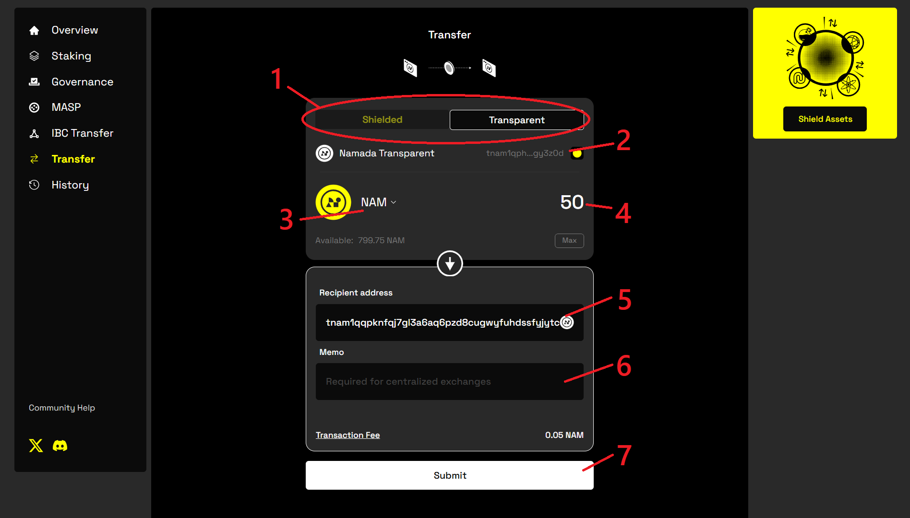
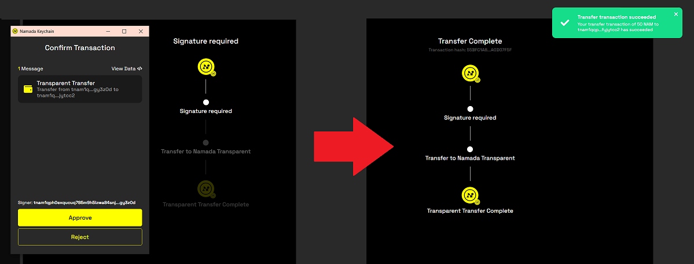

import { Callout, Steps } from 'nextra-theme-docs'

# Shielded and Transparent Transfers with Namadillo

<Callout type='info'>
Namada mainnet will launch with most functionality aside from staking and governance disabled, gradually enabling features in stages (via governance proposals) over the first 
few weeks. Therefore, some sections of Namadillo will not be accessible immediately after launch until its respective functionality has been activated on mainnet.  

Until then, you can experiment with all aspects of Namadillo on [testnet](../networks/testnets.mdx).
</Callout>

Namadillo supports both shielded and transparent transfers of NAM and any other token asset.  

- **Shielded Transfers:** Are sent from one shielded (`znam...`) address to another. This helps prevent third-parties from knowing the details of your 
transactions\*. 
- **Transparent Transfers:** Are sent from one transparent (`tnam...`) address to another. A third party viewing the transaction will be able 
to see the sending address, receiving address, token and amount. Remember that a third party can view the balances and transaction history 
of any transparent address at any point in the chain's history.  

<Callout type='info'>
**\* Note:** while shielded transfers keep your transaction details secure within the protocol itself, be careful not to leak extra information that could allow others to make inferences about 
your activity based on your usage patterns.  

Consider the analogy of borrowing books from a library. If you regularly borrow books on a very specific topic, and only a few people are interested in that topic, others might start guessing 
that you're the one borrowing them. Even though the library doesn't reveal your name, your borrowing pattern gives you away.  

See [this section](../../introduction/privacy.mdx) for more information and best practices.
</Callout>

## Sending a transfer
<Steps>
### Select 'Transfer' from the left sidebar
This will open the *Transfer* dialog, as shown in the image below.

### Choose the transfer type (Shielded/Transparent)
Click the toggle **(marked 1, in the below image)** to switch between shielded and transparent transfers.

### Enter the transfer info
First, check that the sending address displayed near the top of the dialog is the one you expect. If not, open the Keychain extension to switch between your 
accounts.  

*The Transfer dialog for sending both shielded and transparent transfers*  

- **(2)**: Your sending address (automatically filled from the Keychain extension).
- **(3)**: Click here to choose the asset you wish to send.
- **(4)**: Enter the amount you wish to send here.
- **(5)**: Enter the recipient address here. If you've selected shielded transfer, the recipient must be a `znam` (shielded) address. 
If you've selected transparent transfer, the recipient must be a `tnam` (transparent) address.
- **(6)**: (Optionally) enter the memo here. If you're sending (depositing) to a centralized exchange, you are often required by the exchange to 
attach a specific memo in order for your transfer to be processed correctly. Check with your exchange to see what they require.
- **(7)**: Click to submit your transfer after filling in the required info.

### Click 'Submit' and approve your transaction
After entering the required transfer info, click **Submit**. You will be prompted by the extension to approve the transaction; if you're using 
a Ledger, you will be prompted to confirm on the device, otherwise you will be prompted to enter your password.  

After confirming, you'll see a grey dialog box in the top right corner of Namadillo to let you know that your transaction has been submitted 
and is being processed. After roughly 10 seconds, you will see either a green or red dialog box to let you know if your transaction was approved.  

*Completing the transfer*
</Steps>