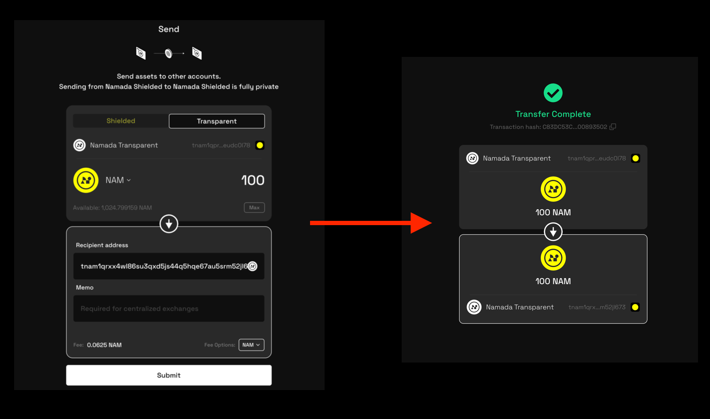

import { Callout, Steps } from 'nextra-theme-docs'

# Transfers Within Namada

Learn more about Namada shielded accounts [here](../shielded-accounts.mdx) and transparent accounts [here](../transparent-accounts.mdx) beyond Namadillo. 

You can send NAM or any other asset from one Namada address to another. There are two types of transfers you can send using Namadillo:

- **Shielded Transfers:** Are sent from one shielded (`znam...`) address to another. This helps prevent third-parties from knowing the details of your 
transactions (see Note below). 
- **Transparent Transfers:** Are sent from one transparent (`tnam...`) address to another. A third party viewing the transaction will be able 
to see the sending address, receiving address, token and amount. Remember that a third party can view the balances and transaction history 
of any transparent address at any point in the chain's history.  

<Callout type='info'>
**Note:** while shielded transfers keep your transaction details secure within the protocol itself, be careful not to leak extra information that could allow others to make inferences about 
your activity based on your usage patterns.  

Consider the analogy of borrowing books from a library. If you regularly borrow books on a very specific topic, and only a few people are interested in that topic, others might start guessing 
that you're the one borrowing them. Even though the library doesn't reveal your name, your borrowing pattern gives you away.  

See [this section](../../introduction/privacy.mdx) for more information and best practices.
</Callout>

## Sending a transfer

To send a transfer using Namadillo, do the following:
1. Select 'Transfer' from the left sidebar, or click the **Transfer** button in the top bar.
2. Using the toggle, select whether you want to send a shielded or transparent transfer. Depending on your choice, the color of the interface will change and either your 
shielded or transparent address will be automatically filled in as the sending address.
3. Select the asset and amount you wish to send.
4. Enter the recipient address in the text field. If you're sending a shielded transfer, the recipient must be a `znam` (shielded) address. If you're sending a transparent transfer, the 
recipient must be a `tnam` (transparent) address.
5. Click **Submit** to begin. Approve the transaction via your Namada Keychain. After a few seconds, you should see a confirmation dialog with the details of your transfer.  

*Sending a transparent transfer*  
