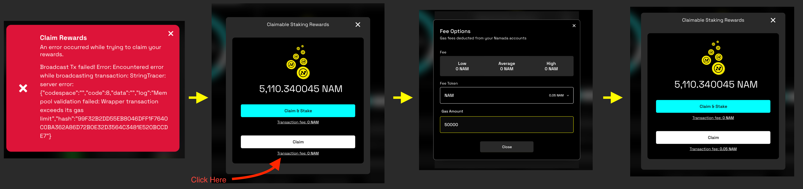

# Namadillo Troubleshooting and Common Issues

### Try Another Namadillo Host
Namadillo has been envisioned as a decentralized front-end, and there are multiple instances of the app running on different servers, hosted and operated by various teams and members of the community. If you're experiencing issues with one 
host, the first course of action should be to try another instance listed on either the [Namada Apps page](https://namada.net/start#interfaces) or the [Luminara Community Site](https://www.namada.community/infra/interfaces).

### 'Transaction Exceeds Its Gas Limit' Error
If you see the error message 'Transaction exceeds its gas limit' when trying to make a transaction (see below), it means that the transaction you're trying to send 
requires more gas to process than you have provided. Usually, Namadillo will automatically calculate the required gas for a transaction, but in some cases you may 
need to manually adjust the gas amount.  

To manually set the gas amount for a transaction, look for the clickable 'Transaction Fee' text when preparing to send a transaction. This will open a dialog 
where you can choose the token with which to pay the fee, and enter the desired gas amount. For most transactions, a gas amount equal to `50000` (0.05 NAM) will be sufficient. 
However, if you're batching multiple transactions together (such as claiming rewards when you've staked to multiple validators) you may need to increase this value.

