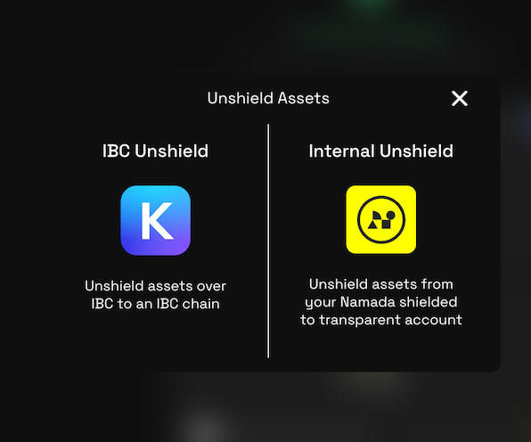
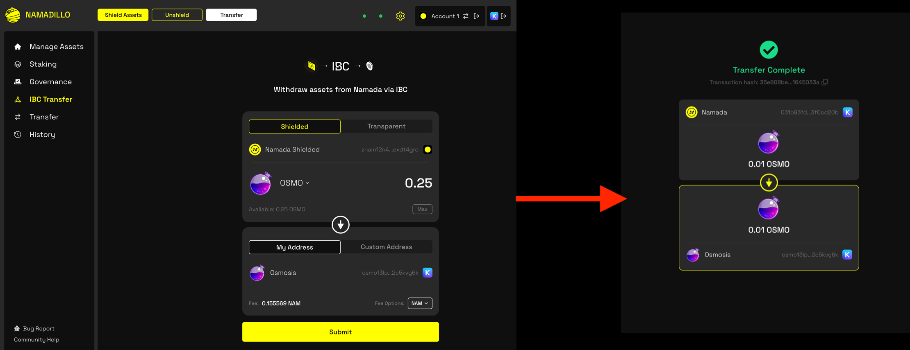
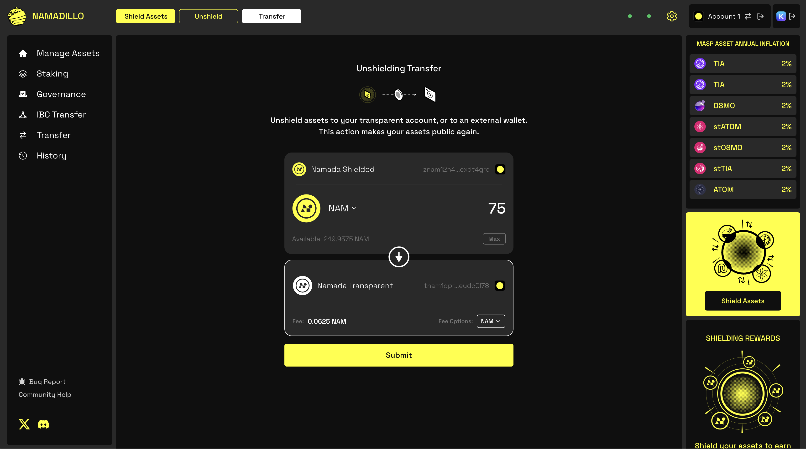
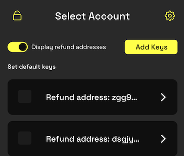
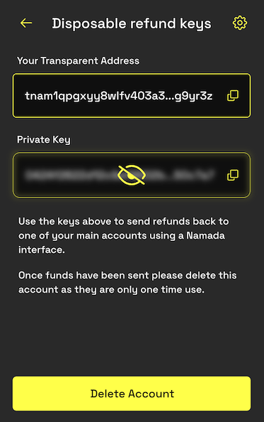

import { Callout, Steps } from 'nextra-theme-docs'

# Unshielding Assets

<Callout type="info">
You can learn more about Namada's Shielded Pool (aka: the MASP) and its features [here](../shielded-accounts.mdx). 
</Callout>

To begin unshielding, click the **Unshield** button in the Namadillo's topbar, and then choose between *IBC Unshield* or *Internal Unshield*.  

- **IBC Unshield**: Withdraw assets directly from your shielded balance to another IBC connected chain.
- **Internal Unshield**: Withdraw assets from your shielded balance to your transparent balance on Namada.

  

## IBC Unshielding
Before you begin, you may wish to install [Keplr wallet](https://www.keplr.app/) and complete the initial setup process to generate an address 
on the destination chain. This will allow you to connect Keplr and auto-fill your wallet address as the destination. However, you can 
also proceed without Keplr and manually enter a destination address.  

For help getting started with Keplr, please refer to https://help.keplr.app/start.  

Once you're ready to begin IBC unshielding, follow these steps:  

1. Click the **Unshield** button in the Namadillo's topbar and select **IBC Unshield**.
2. Select the destination chain/asset and amount you wish to unshield.
3. The **Shielded** toggle should be already selected by default and your Namada shielded address will be displayed. If not, select the **Shielded** toggle now.
4. You can either connect your Keplr wallet or manually enter a destination address. To connect your Keplr wallet, click the **Connect Wallet** button and approve the connection request. 
Once connected, your Keplr wallet address will be displayed and you'll see a Keplr icon at the top of Namadillo. If you'd like to manually enter a destination address, click the 
**Custom Address** toggle and enter the address in the text field.
5. Click **Submit** to begin. Approve the transaction via Namada Keychain. After a few seconds, you should see a confirmation dialog with the details of your unshielding transaction.  

*IBC unshielding*

## Internal Unshielding
Before you can begin internal unshielding, you must hold one or more assets in your shielded balance on Namada. 

To begin internal unshielding, follow these steps:  

1. Click the **Unshield** button in the Namadillo's topbar and select **Internal Unshield**.
2. Select the asset and amount you wish to unshield.
3. Click **Submit** to begin. Approve the transaction via Namada Keychain. After a few seconds, you should see a confirmation dialog with the details of your unshielding transaction.  

*Internal unshielding*

## Failed Transactions and Refund Addresses
Sometimes, due to issues on the destination chain or IBC relayers, your unshielding transaction may fail or timeout. When this happens, your tokens will be returned to you. 
However, since it's not possible for them to be returned directly to your shielded address, a **refund account** will automatically be generated in Namada Keychain to 
receive your tokens in its transparent balance.  

To view your refund account and refunded assets, make sure the toggle switch **Display refund addresses** is enabled and then 
select the refund account in Namada Keychain as you would any other account. It's recommended to transfer the refunded assets to 
one of your other accounts as soon as possible.  

*Displaying refund accounts (make sure the toggle switch is enabled)*

*Selecting the refund account will display its address and private key*

<Callout type="info">
Be aware that since the refund account is automatically generated upon need, you cannot restore it later from a seed phrase. You can, if you wish, view and backup its private key in 
order to restore it in that manner. However, for simplicity it's better to treat this as a disposable account and transfer the refunded assets to one of your other accounts 
as soon as possible, deleting the refund account after doing so.
</Callout>
