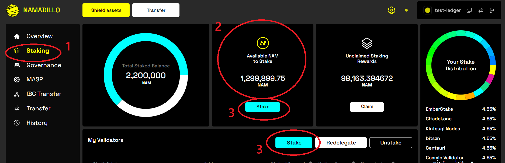
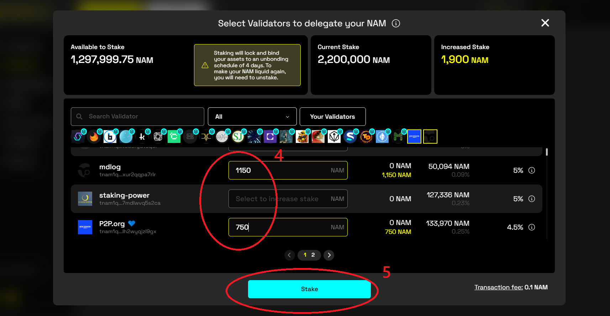
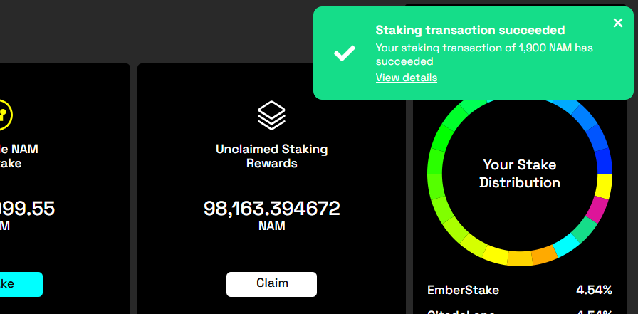
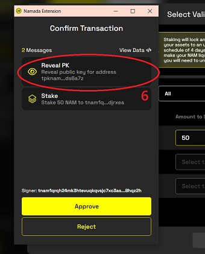

import { Callout } from 'nextra-theme-docs'
import { Steps } from 'nextra-theme-docs'

# Ledger Hardware Wallet

<Callout type="info" emoji={"🎉"}>
The Namada Ledger app is now available on the official Ledger Live app catalog! If you had followed the instructions on previous versions of these 
docs to install the development version from Zondax Hub, make sure you uninstall any pre-release versions of the app and install the latest 
version from Ledger Live before proceeding.
</Callout>

Both the [Namada Keychain](./web-wallet.mdx) browser extension and the Namada CLI are compatible with the [Ledger](https://www.ledger.com/) hardware wallet. 
This guide will walk you through the process of setting up your Ledger device to work with Namada.

## Prerequisites
You will need a Ledger device with the latest firmware installed. You can find instructions on how to update your firmware [here](https://support.ledger.com/hc/en-us/articles/360002731113-Update-device-firmware).

In order to use the Ledger with the web wallet, you will need to install the [Namada Keychain Extension](./web-wallet.mdx#install). To use the Ledger with the Namada CLI, 
you will need to [install the latest version](./../../introduction/install.mdx) of Namada.

## Installing the Namada Ledger app
The Namada Ledger app is available on the official Ledger Live app catalog. Follow the instructions below to install the app on your device.

<Steps>
### Connect your device to your computer 
The remaining steps assume you have already completed the initial Ledger setup and your device is ready to use.

### Open the Ledger Live App Catalog
Open the Ledger Live desktop app and select 'My Device' from the lefthand menu to display the list of available apps.

### Install the Namada app
Scroll down until you find Namada in the list (or use the search bar), and click the 'Install' button to install the latest version on your device.

</Steps>

## Using a Ledger with Namada Keychain (browser extension)

You can use the Ledger app with the Namada Keychain browser extension to sign transactions in front-end web apps. See the 
[Namada Keychain](./web-wallet.mdx) page for instructions on installing and using the Namada Keychain browser extension.

<Callout>
Disclaimer: this will only work on Chrome-enabled browsers at the moment.
</Callout>

### Importing (deriving) your Ledger address
Before any other operations with the Ledger, we will want to derive an address and public key and add them to the extension ([web wallet](./web-wallet.mdx)) under an alias for convenience.
To derive your address using a Ledger:

<Steps>
### Open Namada Keychain and click `Add keys`

### Click `Connect hardware wallet`

### Connect your device to your computer and Open the Namada app
Follow the prompts and click `Next` after each step

### Confirm on device
After the following the prompts, your address and public key will be displayed on your device. Confirm the operation on your device.

### Name your Ledger account
Give your account an easy to remember name.

### Click `Finish setup`
</Steps>

### Display your address/public key
To display your Ledger address/public key, first open Namada Keychain. Find your Ledger account in the list, click the `⋮` icon (three vertical dots) and select 'View keys'. 

## Staking using the Ledger
You can use the Ledger to sign a transactions from a front-end app (such as [Namadillo](./../../integrating-with-namada/interface.mdx)). The example given below is 
for staking with a validator (or validators), but the signing process is essentially the same for any type of transaction you wish to make (transfers, voting on governance, etc.)  

The following assumes you have completed the steps to install the Namada Ledger app, the Namada Keychain browser extension, and completed the initial setup process as described 
in [Importing (deriving) your Ledger Address](#importing-deriving-your-ledger-address) above.

<Steps>
### Open the web app
In your browser, open [Namadillo](https://interface.namada.tududes.com).

### Connect the browser extension
Click the 'Connect Keychain' button in the top right corner and approve the connection request.

### Navigate to the staking dashboard
From the left panel, select 'Staking' **(1, below)**. You should see your available NAM balance displayed in the top-center, under 'Available NAM to stake' **(2, below)**. 
(If your balance is different than expected, check that the correct account is active in the browser extension).

*Namadillo Staking dashboard*
### Stake your tokens
Click on 'Stake' **(either button marked 3, above)**; this will open a new dialog in which you can enter the amounts you wish to stake with each validator **(4, below)**. 
You can stake with multiple validators in a single action. Click 'Stake' again **(5, below)** when you're ready.

*Staking to multiple validators at once*

### Approve the transaction
You will be prompted to approve the transaction in a pop-up. After confirming, you will also be asked to confirm the transaction on your Ledger device.


### Wait for confirmation
You will see a grey dialog box in the top right corner of Namadillo notifying that the transaction is being processed. After roughly 10 seconds you will be informed 
if your transaction was successful.

</Steps>

#### Worth noting:
If this is the first transaction you're making using this address, you'll also see a 'Reveal PK' (Reveal Public Key) transaction bundled with your staking transaction(s) **(6, below)**.

*Example of a staking transaction with Reveal PK message*
## Using the Ledger app with the CLI
You can use your Ledger to sign transactions from the Namada CLI.

### Importing (deriving) your Ledger address
Before any other operations with the Ledger, we will want to derive an address and public key and add them to the [file system wallet](./file-system-wallet.mdx) under an alias for convenience.
To derive your address using a Ledger:

<Steps>
### Connect your device to your computer

### Open the Namada app on your device

### Derive your address / public key
This command will derive your address and public key and add them to your wallet under an `alias` of your choosing:
```bash copy
namadaw derive --use-device --alias $ALIAS
```
The default derivation path is `m/44'/877'/0'/0'/0`. You can use the flag `--hd-path` to specify a different derivation path. Use `namadaw derive --help` for more information.

### Confirm in wallet
List your wallet contents with:
```bash copy
namadaw list
```
You should see your address and pubic key listed under the `$ALIAS` you provided. Beside them should be the label `(external)` indicating that they are associated with a device.
</Steps>

### Signing a transaction
Use the `--use-device` flag when you wish to sign a transaction using the Ledger. For example:
```bash copy
namadac transparent-transfer \
  --source $ALIAS \
  --target $DEST_ADDRESS \
  --token $TOKEN \
  --amount $AMOUNT \
  --use-device
```
When constructing the transfer, the CLI will check your wallet for the public key given under `$ALIAS`. You will then be prompted on the device to approve the transaction

### Troubleshooting
As a first step when troubleshooting Ledger issues, make sure that you have updated your Ledger Live app and Ledger firmware to the latest versions. 
Additionally, check in the Ledger Live app catalog to make sure you have the latest version of the Namada app.

Some common errors you may encounter while using the Ledger with the Namada CLI:

- `Unable to connect to query address and public key from Ledger: Ledger | App Error: | 21781 [APDU_ERROR] Unknown`  
There is a USB connectivity issue; disconnecting and reconnecting the Ledger will often resolve this.

- The CLI panics with `Message:  Failed to sign transaction` or similar.  
Make sure you're using the correct versions of both the Ledger app and Namada binaries

- The CLI panics with `Message:  No signature could be produced for a transaction of type ...`  
Make sure the Ledger account has been properly [added to your wallet](#importing-deriving-your-ledger-address-1).
